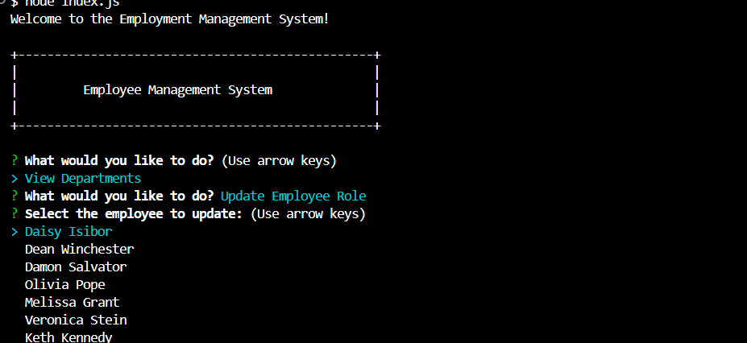
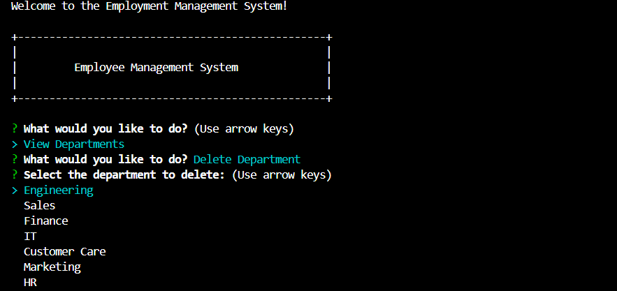

# 12 SQL: Employee Management System

## Video Link.

https://watch.screencastify.com/v/dqiXj8NeV5RygC4M40Zg


[](https://www.gnu.org/licenses/gpl-3.0)


## Table of Contents
- [Description](#description)
- [Installation](#installation)
- [User Story](#user-story)
- [Acceptance Criteria](#acceptance-criteria)
- [Usage](#usage)
- [Tests](#tests)
- [Questions](#questions)
- [Task](#task)
- [License](#license)


## Description

The Employee Management System is a command-line application designed to assist businesses in organizing and managing their employees, roles, and departments effectively. It provides functionalities such as viewing all departments, roles, and employees, adding new departments, roles, and employees, updating employee roles, and more. This system aims to streamline the process of managing personnel data, making it easier for business owners and managers to plan, organize, and track their workforce efficiently.

## Usage


The Employee Management System is utilized by business owners or managers to streamline the process of managing personnel data. Here's a typical usage scenario:

1. Accessing the System: Users start by accessing the application through the command line interface.

2. Main Menu: Upon launching the application, users are presented with a main menu containing various options such as viewing departments, roles, and employees, adding new entries, updating existing data, and more.

3. Navigation: Users navigate through the menu using arrow keys or by typing in their selection.

4. Viewing Data: Users can choose to view all departments, roles, or employees to get an overview of the current state of their workforce.

5. Adding Entries: Users have the option to add new departments, roles, or employees to the system. They are prompted to enter relevant information, such as department names, role titles, employee details, etc.

6. Updating Data: Users can update existing employee roles or other relevant information as needed.

7. Exiting the System: After completing tasks, users can choose to exit the application.

Overall, the Employee Management System provides a user-friendly interface for managing employee-related data efficiently, helping businesses stay organized and productive.

## Task

Developers frequently have to create interfaces that allow non-developers to easily view and interact with information stored in databases. These interfaces are called **content management systems (CMS)**. Your assignment this week is to build a command-line application from scratch to manage a company's employee database, using Node.js, Inquirer, and MySQL.

Because this Challenge will require the use of the `Inquirer` package, ensure that you install and use Inquirer version 8.2.4. To do so, use the following command in your project folder: `npm i inquirer@8.2.4`.

Because this application won’t be deployed, you’ll also need to create a walkthrough video that demonstrates its functionality and all of the following acceptance criteria being met. You’ll need to submit a link to the video and add it to the README of your project.

## User Story

```md
AS A business owner
I WANT to be able to view and manage the departments, roles, and employees in my company
SO THAT I can organize and plan my business
```

## Acceptance Criteria

```md
GIVEN a command-line application that accepts user input
WHEN I start the application
THEN I am presented with the following options: view all departments, view all roles, view all employees, add a department, add a role, add an employee, and update an employee role
WHEN I choose to view all departments
THEN I am presented with a formatted table showing department names and department ids
WHEN I choose to view all roles
THEN I am presented with the job title, role id, the department that role belongs to, and the salary for that role
WHEN I choose to view all employees
THEN I am presented with a formatted table showing employee data, including employee ids, first names, last names, job titles, departments, salaries, and managers that the employees report to
WHEN I choose to add a department
THEN I am prompted to enter the name of the department and that department is added to the database
WHEN I choose to add a role
THEN I am prompted to enter the name, salary, and department for the role and that role is added to the database
WHEN I choose to add an employee
THEN I am prompted to enter the employee’s first name, last name, role, and manager, and that employee is added to the database
WHEN I choose to update an employee role
THEN I am prompted to select an employee to update and their new role and this information is updated in the database 
```

## Installation

To install and set up the Employee Management System, follow these steps:

1. Clone the Repository: Start by cloning the repository containing the Employee Management System code from GitHub.
   git clone <repository-url>

2. Install Dependencies: Navigate into the project directory and install the required dependencies using npm.
    cd EmployeeManagementSystem
     npm install

     You’ll need to use the [MySQL2 package](https://www.npmjs.com/package/mysql2) to connect to your MySQL database and perform queries, and the [Inquirer package](https://www.npmjs.com/package/inquirer/v/8.2.4) to interact with the user via the command line.


 3. Set Up MySQL Database: Make sure you have MySQL installed on your system. Create a MySQL database and configure the connection details in the project's configuration file (config/connection.js).   

 4.  Seed the Database (Optional): If there are sample data provided or seed files, you can use them to populate the database with initial data. npm run seed

 5. Start the Application: Once everything is set up, start the application.  
    node index.js

 6. Follow Instructions: Follow the prompts and instructions provided by the application to manage departments, roles, and employees.

     By following these steps, you'll have the Employee Management System up and running on your local machine, ready for use.    

## Tests

For testing the Employee Management System, you can perform manual testing by executing various functionalities and ensuring they behave as expected. Here are some scenarios you can test:


Viewing Departments, Roles, and Employees:


Verify that all departments, roles, and employees are displayed correctly when selecting the corresponding options from the main menu.
Adding Departments, Roles, and Employees:


Add new departments, roles, and employees and verify that they are successfully added to the database.
Updating Employee Roles:


Update the role of an existing employee and ensure that the changes reflect correctly in the database.
Viewing Employees by Manager or Department:



If implemented, test the functionality to view employees by manager or department and ensure the results are accurate.
Deleting Departments, Roles, and Employees:



Test the deletion functionality for departments, roles, and employees and verify that the corresponding records are removed from the database.

## Questions

- **GitHub**: [daisy isibor](https://github.com/daisy isibor)
- **Email**: daisyisibor9@duck.com

## License
  This project is licensed under the [GPLv3 License](https://www.gnu.org/licenses/gpl-3.0)